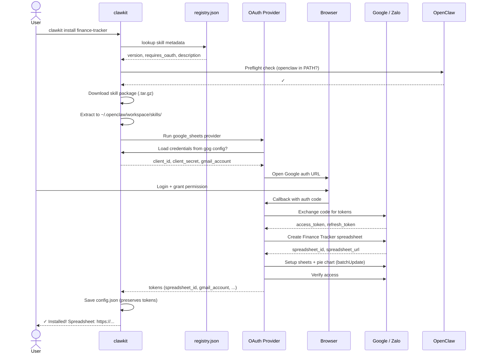
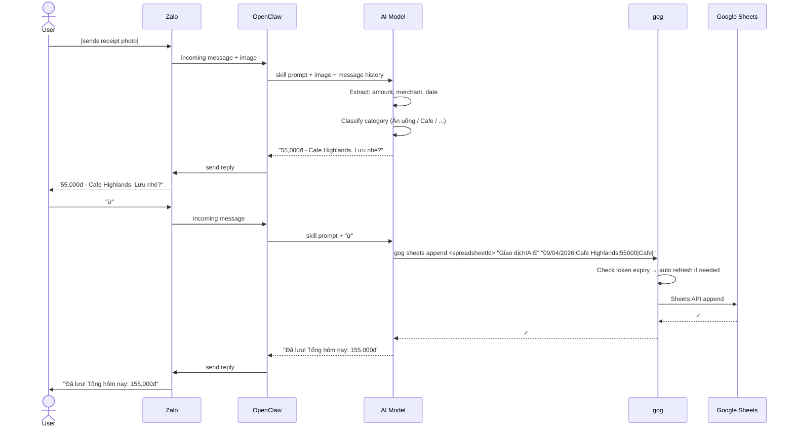
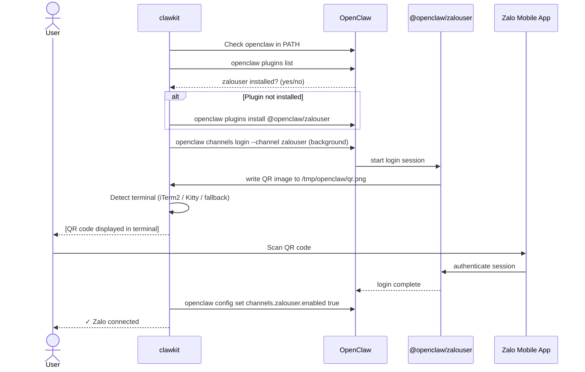
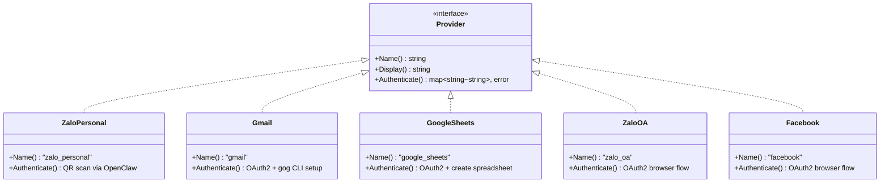
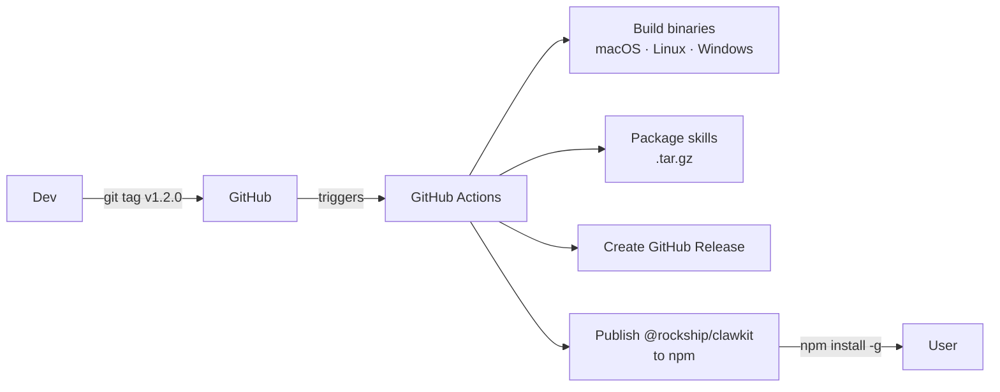

# Architecture

Technical reference for contributors and developers.

---

## System Overview

```mermaid
graph TB
    subgraph User Machine
        CLI["clawkit CLI<br/>(Go binary via npm)"]
        OC["OpenClaw Runtime"]
        GOG["gog CLI<br/>(Google Workspace)"]
        Skills["~/.openclaw/workspace/skills/"]
    end

    subgraph External Services
        Zalo[(Zalo)]
        GSheets[(Google Sheets)]
        Gmail[(Gmail / Calendar)]
        NPM[(npm registry<br/>@rockship/clawkit)]
        GHR[(GitHub Releases<br/>skill packages)]
    end

    subgraph Rockship
        Repo["GitHub Repo<br/>(private)"]
        CI["GitHub Actions CI"]
    end

    User -->|npm install -g| NPM
    NPM --> CLI
    User -->|clawkit install| CLI
    CLI -->|download .tar.gz| GHR
    CLI -->|OAuth flow| External Services
    CLI -->|write skill files| Skills
    OC -->|load skill prompt| Skills
    OC -->|chat channel| Zalo
    OC -->|gog sheets append| GOG
    GOG -->|Sheets API| GSheets
    GOG -->|Gmail API| Gmail
    Repo -->|git tag vX.Y.Z| CI
    CI -->|publish| NPM
    CI -->|upload packages| GHR
```

---

## Component Responsibilities

| Component | Role |
|-----------|------|
| **clawkit** | Install, update, and manage skills. Runs OAuth once at install time. |
| **OpenClaw** | AI runtime — loads skill prompts, manages chat channels, routes messages. |
| **gog CLI** | Google API proxy — handles Gmail, Sheets, Calendar with auto token refresh. |
| **Skills** | SKILL.md prompt files that define AI behavior and tool usage. |

---

## Install Flow



---

## Daily Usage Flow (finance-tracker)



---

## Zalo Personal Auth Flow



---

## OAuth Provider Architecture

Each OAuth provider is a self-registering Go struct. No central registry needed.



Each provider calls `Register()` in its `init()` function — adding a new provider requires only creating a new file.

---

## Token Management

| Provider | Token storage | Refresh handled by |
|----------|-------------|-------------------|
| `zalo_personal` | OpenClaw internal | OpenClaw runtime |
| `gmail` | gog CLI keyring | gog CLI (automatic) |
| `google_sheets` | gog CLI keyring (via gog) | gog CLI (automatic) |
| `zalo_oa` | config.json | Not implemented (short-lived) |
| `facebook` | config.json | Not implemented (short-lived) |

> **Design principle:** clawkit uses OAuth tokens only once at install time (e.g. creating a spreadsheet). After install, all API calls go through gog CLI or OpenClaw, both of which handle token refresh automatically.

---

## Skill Package Format

A skill is a directory with a required `SKILL.md`:

```
skills/your-skill/
├── SKILL.md         # YAML frontmatter + OpenClaw prompt (required)
├── catalog.json     # Product/service catalog (optional)
├── init_db.py       # Database initialization (optional)
└── [assets]         # Images, scripts, etc.
```

`SKILL.md` frontmatter drives everything — `registry.json` is auto-generated from it:

```yaml
---
name: finance-tracker
description: "Receipt scan → categorize → Google Sheets"
version: "1.0.0"
requires_oauth:
  - google_sheets     # OAuth providers to run at install
setup_prompts: []     # Deprecated — use SKILL.md placeholders instead
metadata:
  openclaw:
    emoji: "💰"
    requires:
      bins: ["gog"]   # External binaries required at runtime
---
```

---

## Release Pipeline



Triggered by pushing a version tag:

```bash
git tag v1.2.0
git push origin v1.2.0
```
