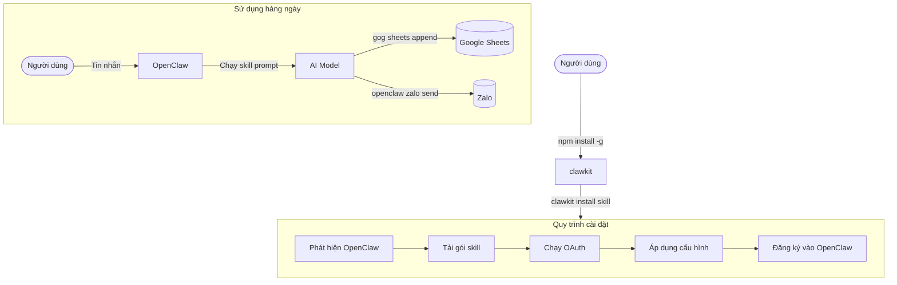

# clawkit

CLI chính thức để cài đặt và quản lý [OpenClaw](https://docs.openclaw.ai) skills.

```bash
npm install -g @rockship/clawkit
```

Phát triển bởi [Rockship](https://rockship.co) · [English](./README.md)

---

## Yêu cầu

**Node.js 16 trở lên** là bắt buộc. Nếu chưa cài:

- **Tải về:** [nodejs.org](https://nodejs.org) — chọn phiên bản LTS
- **macOS (Homebrew):** `brew install node`
- **Windows (winget):** `winget install OpenJS.NodeJS.LTS`
- **Linux:** `sudo apt install nodejs npm` hoặc dùng [nvm](https://github.com/nvm-sh/nvm)

Kiểm tra sau khi cài:

```bash
node --version   # phải là v16 trở lên
npm --version
```

**OpenClaw** cũng phải được cài đặt và đang chạy trên máy. Xem [hướng dẫn cài OpenClaw](https://docs.openclaw.ai/installation).

---

## Cài đặt

```bash
npm install -g @rockship/clawkit
```

Hỗ trợ macOS (Apple Silicon & Intel), Linux và Windows.

Kiểm tra:

```bash
clawkit version
```

---

## Bắt đầu nhanh

```bash
# Xem danh sách skills có sẵn
clawkit list

# Cài đặt một skill
clawkit install shop-hoa-zalo

# Kiểm tra các skill đã cài
clawkit status
```

---

## Danh sách Skills

| Skill | Mô tả |
|-------|-------|
| `shop-hoa-zalo` | Bot bán hoa qua Zalo cá nhân — tự động trả lời, báo giá, gửi ảnh, chốt đơn |
| `carehub-baby` | Trợ lý tư vấn sữa Blackmores cho CareHub Baby & Family qua Zalo |
| `gog` | Trợ lý Google Workspace — Gmail, Calendar, Drive, Contacts |

---

## Các lệnh

| Lệnh | Mô tả |
|------|-------|
| `clawkit list` | Liệt kê skills có sẵn và trạng thái cài đặt |
| `clawkit install <skill>` | Cài đặt skill (chạy OAuth + cấu hình) |
| `clawkit update <skill>` | Cập nhật skill, giữ nguyên token và config |
| `clawkit status` | Hiển thị các skill đã cài |
| `clawkit version` | In phiên bản hiện tại |

---

## Cách hoạt động



Xem chi tiết kiến trúc tại [ARCHITECTURE.md](./ARCHITECTURE.md).

### Xác thực Zalo

Không cần App ID hay App Secret. clawkit sử dụng tích hợp Zalo có sẵn của OpenClaw. Bạn chỉ cần quét mã QR một lần từ ứng dụng Zalo trên điện thoại:

```
[1/3] Kiểm tra OpenClaw...         ✓
[2/3] Tải Zalo plugin...           ✓
[3/3] Quét mã QR bằng Zalo

██████████████████████████
█ ▄▄▄▄▄ █▀█▄▄▀▄█ ▄▄▄▄▄ █
█ █   █ █ ▀▄▄▄█ █   █ █
...

Đang chờ quét... (tối đa 3 phút)
✓ Đã kết nối Zalo
```

---

## Phát triển

### Thêm Skill mới

1. Tạo thư mục trong `skills/`:

```
skills/ten-skill/
├── SKILL.md        # Bắt buộc: YAML frontmatter + OpenClaw prompt
├── catalog.json    # Tùy chọn: danh mục sản phẩm/dịch vụ
├── init_db.py      # Tùy chọn: khởi tạo cơ sở dữ liệu
└── [tài nguyên khác]
```

2. Thêm YAML frontmatter vào `SKILL.md`:

```yaml
---
version: "1.0.0"
description: "Mô tả ngắn về skill"
requires_oauth:
  - zalo_personal
setup_prompts: []
---
```

3. Tạo lại registry và kiểm thử:

```bash
make generate
make build
./clawkit install ten-skill --skip-oauth
```

> `registry.json` được tự động tạo từ frontmatter của SKILL.md. Không chỉnh sửa trực tiếp.

### Phát hành phiên bản mới

Chỉ cần đẩy một version tag — GitHub Actions sẽ tự động xử lý toàn bộ:

```bash
git tag v1.2.0
git push origin v1.2.0
```

CI sẽ tự build binary cho tất cả nền tảng, tạo GitHub Release và publish `@rockship/clawkit` lên npm.

---

## Giấy phép

MIT
